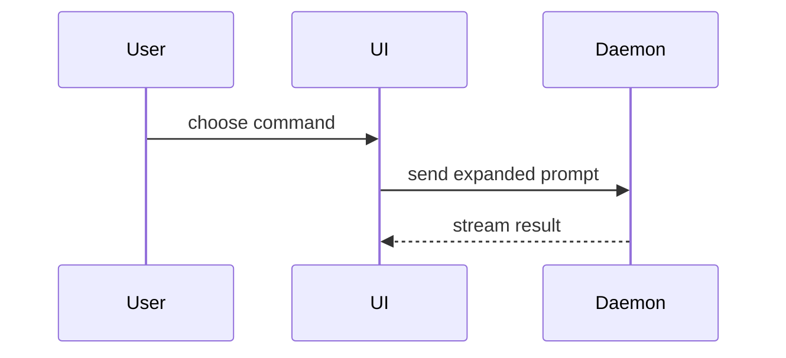

Use this template for writing the PR body:

```markdown
## Summary

<diagram, diff-sketch, or tree>

## Evidence

- **Before:** <screenshot/output/failing test run>
  **After:** <screenshot/output/passing test run>

## Manual Testing

<only for user-facing changes; omit the heading otherwise>

**Setup:** <branch, env, seed data, flags, URL>

1. <action>. **Expect:** <observable result>
2. ...

## Merge Danger

**Undo:** <`git revert` is enough | needs cleanup | permanent>

<optional: what reverting does not restore>

**Blast Radius:** <one-word description>

<optional: potential ramifications of merge>
```

## Sections

Skip all preambles and keep prose brief. Use the user's domain language from `GLOSSARY.md`.

### Summary

Pick the smallest view that makes the key point clear.

- Show logic or an algorithm as pseudocode:

```text
on(save)
  if content is unchanged
    return cached result
  write new content
  return fresh result
```

- Show runtime control flow as a call tree:

```text
submitForm
  createSession
    persistPrompt
    launchAgent
  navigateToSession
```

- Show UI structure as a component tree, including state and module boundaries that matter:

```text
<SessionPage> (apps/example/src/routes/session.tsx)
  useSessionEvents()
  <SessionToolbar>
    <RunSkillButton> (packages/ui)
```

- Show file responsibility or a broad refactor as a shallow file tree:

```text
src/
├── commands/       # parses user actions
├── sessions/       # owns session state
└── transport/      # sends API requests
```

- Show component interaction, control flow, or data flow with Mermaid:



- Use `diff` when the point is what changes and the surrounding shape already exists. Match the diff shape to the topic.

For a component change:

```diff
 <SessionPage>
   useSessionEvents()
   <SessionToolbar>
+    <RunSkillButton />
   <SessionTimeline>
+    <SkillResultCard />
```

For a file-layout change:

```diff
 src/
 ├── commands/
+│   └── show-me.ts       # expands the slash command
 ├── sessions/
-└── transport.ts
+└── transport/
+    ├── client.ts
+    └── stream.ts
```

For a call-tree or call-stack change:

```diff
 submitForm
   createSession
     persistPrompt
+    expandSkillMention
     launchAgent
-  navigateToSession
+  navigateToSession
+    subscribeToEvents
```

For a state or control-flow change:

```diff
 on(save)
-  write content
+  if content is unchanged
+    return cached result
+  write new content
+  invalidate cache
```

- Show the whole block when most of it is new, when omitted context would hide ownership or order, or when the user needs a copyable target shape:

```ts
function expandSkill(command: string): string {
  const skillName = command.slice(1);
  return `use the ${skillName} skill`;
}
```

#### Guidance

Place each visual next to the short text it supports. Keep only the calls, files, props, states, and boundaries needed to answer the user's current question or the options to resolve the current discussion point.

You may use one of these, you may use several, it is unlikely you will use all of them. Use your judgement and don't overwhelm the user.

### Evidence

Concrete evidence that the change works. Show a before and after.

Screenshots are S-tier - when the environment is set up for it and the change is visual.

Execution-based evidence is A-tier. Test results, console output. Show the exact test that now fails and passes, using pseudocode.

When the change is visual but you can't capture a screenshot, the Manual Testing steps are how the reviewer collects that evidence.

### Manual Testing

Include this section when a person can see or touch the change: UI, CLI output, user-visible errors, emails, copy. Omit the heading entirely for refactors, internal APIs, and changes automated tests fully prove.

**Setup** lists only what the reviewer can't guess: the flag to enable, the data to seed, the role to log in as, the viewport or browser.

Each step is one action and the result the reviewer should observe. Name the exact route, button label, and input value, so the reviewer never has to hunt:

```markdown
**Setup:** `pnpm dev`, log in as `admin@example.com`

1. Open `/settings/profile` and change **Display name** to `Ada`. **Expect:** the **Save** button enables.
2. Click **Save**. **Expect:** a "Profile updated" toast, and the header shows `Ada`.
3. Clear **Display name** and click **Save**. **Expect:** inline error "Name is required", no request sent.
4. Resize to 375px wide. **Expect:** the form stacks into one column with no horizontal scroll.
```

Order the steps happy path first, then the edge cases your Blast Radius names: empty states, error paths, narrow viewports, keyboard navigation. Leave out anything a test in Evidence already covers. Past about 8 steps, split into separate flows, each under its own bold title.

### Merge Danger

State how hard the change is to undo after merge.

- **`git revert` is enough**: reverting the commit restores the previous behavior completely.
- **needs cleanup**: reverting the code isn't enough. Something else has to be fixed by hand, such as a cache flush, a config change, or telling consumers.
- **permanent**: some effects stay even after a revert. Examples: deleted data, a migration that already ran, a published API or package version, messages already sent.

When it isn't `git revert`, name what the revert leaves behind.

The blast radius is the potential impact or scope of the changes introduced by this PR. Consider all possibilities. Examples are layout shift, breakages for consumers, mobile responsiveness, etc. When a reviewer can check a blast-radius risk by hand, add it as a Manual Testing step.
